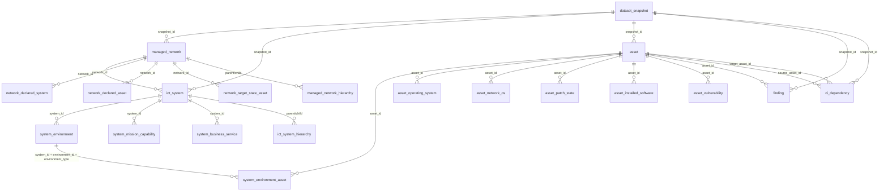

# TSAAT ERD (SQL Server)

`app_user` is a standalone authentication table (no foreign keys) that stores salted password-hash credentials, active flag, and session-version invalidation metadata.

## CI Dependency Domain
- `ci_dependency` stores directed CI-to-CI links:
  - `source_asset_id -> target_asset_id`
  - `dependency_type`: `Logical Dependency` or `Flow Dependency`
  - Optional flow metadata: protocol/ports/observation fields.
- The model supports both ICT System model and Network model flow visualisations.

## Operational Notes
- Connection/auth settings are external to this ERD and are configured in encrypted repository root `DB_config`.
- `managed_network` includes platform flags:
  - `adf_platform` (`BIT`)
  - `enterprise_platform` (`BIT`)
- `ict_system` includes platform flags:
  - `adf_platform` (`BIT`)
  - `enterprise_platform` (`BIT`)
