# TSAAT ERD (SQL Server)

```mermaid
erDiagram
  dataset_snapshot ||--o{ managed_network : "snapshot_id"
  dataset_snapshot ||--o{ ict_system : "snapshot_id"
  dataset_snapshot ||--o{ asset : "snapshot_id"
  dataset_snapshot ||--o{ finding : "snapshot_id"
  dataset_snapshot ||--o{ ci_dependency : "snapshot_id"

  managed_network ||--o{ ict_system : "network_id"
  managed_network ||--o{ network_declared_system : "network_id"
  managed_network ||--o{ network_declared_asset : "network_id"
  managed_network ||--o{ network_target_state_asset : "network_id"
  managed_network ||--o{ managed_network_hierarchy : "parent/child"

  ict_system ||--o{ system_environment : "system_id"
  ict_system ||--o{ system_mission_capability : "system_id"
  ict_system ||--o{ system_business_service : "system_id"
  ict_system ||--o{ ict_system_hierarchy : "parent/child"

  system_environment ||--o{ system_environment_asset : "system_id + environment_id + environment_type"
  asset ||--o{ system_environment_asset : "asset_id"

  asset ||--o{ asset_operating_system : "asset_id"
  asset ||--o{ asset_network_os : "asset_id"
  asset ||--o{ asset_patch_state : "asset_id"
  asset ||--o{ asset_installed_software : "asset_id"
  asset ||--o{ asset_vulnerability : "asset_id"
  asset ||--o{ finding : "asset_id"

  asset ||--o{ ci_dependency : "source_asset_id"
  asset ||--o{ ci_dependency : "target_asset_id"

  measures_settings_version ||--o{ measures_severity_matrix : "settings_version_id"
  measures_settings_version ||--o{ measures_priority_matrix : "settings_version_id"
  finding_severity_definition ||--o{ measures_severity_matrix : "severity"
  finding_severity_definition ||--o{ finding : "severity"
  finding_severity_definition ||--o{ spi_finding_classification_rule : "severity_key"
  finding_priority_definition ||--o{ measures_priority_matrix : "priority_rank"
  finding_priority_definition ||--o{ finding : "priority_rank"
  finding_priority_definition ||--o{ spi_finding_classification_rule : "priority_rank"
  finding_source_policy ||--|| finding_generation_policy : "policy_key"
  finding_workflow_status_definition ||--o{ finding_bucket_definition : "workflow_status"
  spi_rule_definition ||--o{ spi_definition : "rule_key"
  spi_rule_definition ||--o{ spi_rule_parameter_definition : "rule_key"
  spi_rule_definition ||--o{ spi_rule_outcome_template : "rule_key"
  spi_rule_definition ||--o{ spi_calculation_definition : "rule_key"
  spi_calculation_source ||--o{ spi_calculation_definition : "source_key"
  spi_calculation_definition ||--o{ spi_calculation_evidence_expression : "rule_key"
  spi_report_detail_definition ||--o{ spi_definition : "report_detail_key"
  spi_definition ||--o{ measures_severity_matrix : "spi_id"
  spi_definition ||--o{ measures_priority_matrix : "spi_id"
  spi_definition ||--o{ spi_finding_classification_rule : "spi_id"
  spi_definition ||--o{ spi_applicable_asset_type : "spi_id"
  spi_definition ||--o{ spi_rule_parameter : "spi_id"
  spi_definition ||--o{ spi_tasking_team : "spi_id"
  spi_definition ||--o{ spi_tasking_action_template : "spi_id"
  spi_definition ||--o{ spi_tasking_condition_template : "spi_id"
  spi_definition ||--o{ spi_feature_binding : "spi_id"
  kpi_calculation_source ||--o{ kpi_calculation_definition : "source_key"
  kpi_calculation_definition ||--o{ kpi_calculation_parameter : "calculation_key"
  kpi_calculation_definition ||--o{ kpi_definition : "calculation_key"
  kpi_definition ||--o{ kpi_report_detail_binding : "kpi_id"
  kpi_report_detail_definition ||--o{ kpi_report_detail_binding : "report_detail_key"
  kpi_definition ||--o{ kpi_tasking_team : "kpi_id"
  kpi_definition ||--o{ kpi_tasking_action_template : "kpi_id"
  kpi_definition ||--o{ kpi_tasking_condition_template : "kpi_id"
  discovery_coverage_source ||--o{ discovery_tool_detection_rule : "source_key"
  discovery_tool ||--o{ discovery_tool_detection_definition : "tool_id"
  discovery_tool_detection_definition ||--o{ discovery_tool_detection_rule : "detection_key"
  discovery_tool_detection_rule ||--o{ discovery_tool_detection_rule_value : "detection_key"

  kpi_definition {
    string kpi_id
    int display_order
    string calculation_key
    boolean enabled
    boolean report_available
  }

  kpi_calculation_source {
    string source_key
    string source_object_name
    int display_order
    boolean enabled
  }

  kpi_calculation_definition {
    string calculation_key
    string source_key
    string handler_key
    int display_order
    boolean enabled
  }

  kpi_calculation_parameter {
    string calculation_key
    string parameter_key
    string parameter_type
    boolean required
  }

  kpi_report_detail_definition {
    string report_detail_key
    string handler_key
    int display_order
    boolean enabled
  }

  kpi_report_detail_binding {
    string kpi_id
    string report_detail_key
  }

  kpi_tasking_team {
    string kpi_id
    int display_order
    string team
  }

  kpi_tasking_action_template {
    string kpi_id
    int display_order
    string condition_key
  }

  kpi_tasking_condition_template {
    string kpi_id
    string condition_key
  }

  discovery_coverage_source {
    string source_key
    string source_object_name
    int display_order
    boolean enabled
  }

  discovery_tool_detection_definition {
    string detection_key
    string tool_id
    string handler_key
    boolean enabled
  }

  discovery_tool_detection_rule {
    string detection_key
    string source_key
    string condition_key
    boolean enabled
  }

  discovery_tool_detection_rule_value {
    string detection_key
    string value_key
    string value_text
  }

  spi_definition {
    int spi_id
    int display_order
    string rule_key
    string report_detail_key
    boolean enabled
    boolean report_available
    boolean trend_report_available
  }

  spi_rule_definition {
    string rule_key
    string handler_key
    int display_order
    boolean enabled
  }

  spi_rule_parameter_definition {
    string rule_key
    string parameter_key
    string parameter_type
    boolean required
  }

  spi_rule_outcome_template {
    string rule_key
    string outcome_key
    string compliance_status
  }

  spi_report_detail_definition {
    string report_detail_key
    string handler_key
    int display_order
    boolean enabled
  }

  spi_calculation_source {
    string source_key
    string source_object_name
    int display_order
    boolean enabled
  }

  spi_calculation_definition {
    string rule_key
    string source_key
    int display_order
    string status_expression_sql
    string outcome_expression_sql
    boolean enabled
  }

  spi_calculation_evidence_expression {
    string rule_key
    string evidence_key
    int display_order
    string value_type
  }

  spi_feature_binding {
    string feature_key
    int spi_id
    int display_order
    string compliance_status
    string outcome_key
  }

  spi_finding_classification_rule {
    string classification_rule_id
    int display_order
    int spi_id
    string condition_key
    string severity_key
    int priority_rank
  }

  finding_severity_definition {
    string severity_key
    string label
    int display_order
    boolean selectable_in_settings
    string tone_key
  }

  finding_priority_definition {
    int priority_rank
    string label
    int display_order
    boolean selectable_in_settings
  }

  finding_source_policy {
    string policy_key
    int display_order
    boolean use_persisted_findings
    boolean generate_when_empty
    boolean enabled
  }

  finding_generation_policy {
    string policy_key
    date history_start_date
    int history_window_years
    int baseline_backlog_count
  }

  finding_workflow_status_definition {
    string status_key
    string label
    int display_order
    string tone_key
  }

  finding_bucket_definition {
    string bucket_key
    string bucket_type
    string condition_key
    string tone_key
    boolean enabled
  }

  finding_evidence_field_definition {
    string field_key
    string purpose_key
    string candidate_keys_json
    boolean enabled
  }

  finding_register_column_definition {
    string column_key
    string label
    int display_order
    string value_key
    boolean enabled
  }
```

## CI Dependency Domain
- `ci_dependency` stores directed CI-to-CI links:
  - `source_asset_id -> target_asset_id`
  - `dependency_type`: `Logical Dependency` or `Flow Dependency`
  - Optional flow metadata: protocol/ports/observation fields.
- The model supports both ICT System model and Network model flow visualisations.

## Operational Notes
- Connection/auth settings are external to this ERD and are configured in local encrypted repository root `DB_config`, which `/settings`, `CreateDB.cmd`, and `compileApp.cmd` can confirm, update, or recreate when the local DPAPI file is missing/undecryptable.
- Application login credentials are external to this ERD and are configured in local encrypted repository root `logindetails`.
- `managed_network` includes platform flags:
  - `adf_platform` (`BIT`)
  - `enterprise_platform` (`BIT`)
- `managed_network` includes `modelling_status` (`BIT`) for persisted network model coverage state.
- `managed_network` includes accreditation references:
  - `diis_id` (`NVARCHAR(100)`)
  - `ato_number` (`NVARCHAR(100)`)
  - `apm_number` (`NVARCHAR(100)`)
- `ict_system` includes platform flags:
  - `adf_platform` (`BIT`)
  - `enterprise_platform` (`BIT`)
- `ict_system` includes accreditation/application references:
  - `diis_id` (`NVARCHAR(100)`)
  - `ato_number` (`NVARCHAR(100)`)
  - `apm_number` (`NVARCHAR(100)`)
- Measures settings are versioned:
  - `measures_severity_matrix` maps SPI and asset type to finding severity through `finding_severity_definition`.
  - `measures_priority_matrix` maps SPI to selectable priority ranks through `finding_priority_definition`; current selectable values are P1-P7 and P90 remains non-selectable for Unknown/Data Gap findings.
- SPI metadata is database-driven:
  - `spi_definition` stores catalogue text, display order, enabled/report flags, supported `rule_key`, default severity, and supported report detail key.
  - `spi_rule_definition` and `spi_report_detail_definition` are catalogues for rule and report-detail keys.
  - `spi_rule_parameter_definition` stores rule parameter schema/defaults and `spi_rule_outcome_template` stores DB-backed reason/evidence templates.
  - `spi_calculation_source`, `spi_calculation_definition`, and `spi_calculation_evidence_expression` store constrained SQL calculation expressions evaluated by `usp_evaluate_spi_snapshot` over `vw_spi_asset_evaluation_context`; the runtime procedure supports optional JSON asset scoping.
  - `spi_feature_binding` maps named application features, such as OS posture filters and production critical exposure classification, to database SPI rows/statuses/outcomes rather than fixed SPI IDs.
  - `spi_finding_classification_rule` stores generated finding severity/priority rules using controlled condition keys.
  - `spi_applicable_asset_type` controls applicability by asset type.
  - `spi_rule_parameter` stores typed parameters consumed by SQL helper functions during SPI evaluation.
  - `spi_tasking_team`, `spi_tasking_action_template`, and `spi_tasking_condition_template` store tasking contacts and report text templates.
- SPI calculations are SQL-driven at runtime through approved read-only expressions over approved context objects; unrestricted formulas, JavaScript, and arbitrary SQL batches are not supported.
- KPI and discovery coverage metadata is database-driven:
  - `kpi_definition` stores KPI catalogue text, display order, enabled flag, calculation key, and report availability.
  - `kpi_calculation_source`, `kpi_calculation_definition`, and `kpi_calculation_parameter` store SQL-backed KPI calculation metadata evaluated by `usp_evaluate_kpi_snapshot`; `usp_evaluate_kpi_snapshot_bulk` returns KPI rows for multiple scoped report matrix rows in one SQL call.
  - `kpi_report_detail_definition`, `kpi_report_detail_binding`, `kpi_tasking_team`, `kpi_tasking_action_template`, and `kpi_tasking_condition_template` store KPI report/tasking metadata.
  - `discovery_coverage_source`, `discovery_tool_detection_definition`, `discovery_tool_detection_rule`, and `discovery_tool_detection_rule_value` store SQL-backed discovery coverage detection rules evaluated by `usp_evaluate_discovery_coverage_snapshot`.
- KPI and discovery coverage calculations are SQL-driven at runtime through approved stored procedures and seeded rule rows; unrestricted formulas, JavaScript, and arbitrary SQL batches are not supported.
- Finding features are database-driven:
  - `finding_source_policy` and `finding_generation_policy` control persisted-first effective finding selection and generated fallback policy.
  - `finding_workflow_status_definition`, `finding_bucket_definition`, `finding_evidence_field_definition`, and `finding_register_column_definition` store workflow, grouping, evidence display, and register/export semantics.
  - `vw_persisted_finding_normalized`, `usp_generate_spi_findings_snapshot`, `usp_get_effective_findings_snapshot`, `usp_get_finding_history_snapshot`, and `usp_get_finding_spi_history_snapshot` provide SQL-backed effective findings and history datasets.
