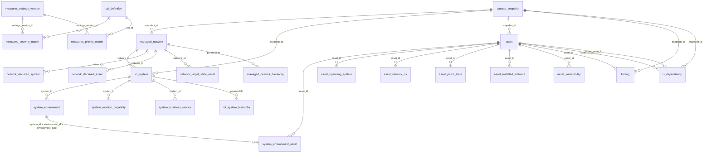

# TSAAT ERD (SQL Server)

## CI Dependency Domain
- `ci_dependency` stores directed CI-to-CI links:
  - `source_asset_id -> target_asset_id`
  - `dependency_type`: `Logical Dependency` or `Flow Dependency`
  - Optional flow metadata: protocol/ports/observation fields.
- The model supports both ICT System model and Network model flow visualisations.

## Operational Notes
- Connection/auth settings are external to this ERD and are configured in local encrypted repository root `DB_config`, which `/settings`, `CreateDB.cmd`, and `compileApp.cmd` can confirm, update, or recreate when the local DPAPI file is missing/undecryptable.
- Application login credentials are external to this ERD and are configured in local encrypted repository root `logindetails`.
- `managed_network` includes platform flags:
  - `adf_platform` (`BIT`)
  - `enterprise_platform` (`BIT`)
- `managed_network` includes `modelling_status` (`BIT`) for persisted network model coverage state.
- `managed_network` includes accreditation references:
  - `diis_id` (`NVARCHAR(100)`)
  - `ato_number` (`NVARCHAR(100)`)
  - `apm_number` (`NVARCHAR(100)`)
- `ict_system` includes platform flags:
  - `adf_platform` (`BIT`)
  - `enterprise_platform` (`BIT`)
- `ict_system` includes accreditation/application references:
  - `diis_id` (`NVARCHAR(100)`)
  - `ato_number` (`NVARCHAR(100)`)
  - `apm_number` (`NVARCHAR(100)`)
- Measures settings are versioned:
  - `measures_severity_matrix` maps SPI and asset type to finding severity.
  - `measures_priority_matrix` maps SPI to P1-P7 priority rank for non-compliant findings.
